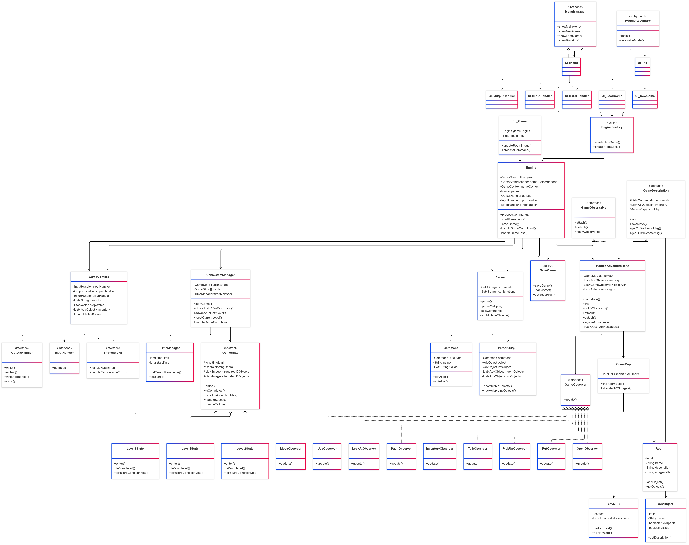

<div style="display: flex; justify-content: space-between; align-items: center; padding: 20px 0; border-bottom: 1px solid #ccc;">
  <div style="text-align: left;">
    
  </div>
  <div style="text-align: right;">
    <p style="margin: 0; font-size: 16px; color: #666;">Dipartimento di Informatica</p>
    <p style="margin: 0; font-size: 16px; color: #666;">CdL in Informatica</p>
    <p style="margin: 0; font-size: 16px; color: #666;">Metodi Avanzati di Programmazione</p>
  </div>
</div>

<!-- PAGINA DI COPERTINA -->
<div style="page-break-after: always; min-height: 100vh; display: flex; align-items: center; justify-content: center;">
  <div style="text-align: center; border: 2px solid ##FF0000	; padding: 30px 40px; background-color: #f9f9f9; max-width: 600px;">
    <h1 style="font-size: 30px; margin-bottom: 5px; color: #000;">PoggioAdventure</h1>
    <h2 style="font-size: 22px; margin-top: 0; margin-bottom: 15px; color: #000;">Spaccamelons</h2>
    <!-- IMMAGINE CENTRATA -->
    <div style="margin: 15px 0;">
      
    </div>
    <!-- SEZIONE AUTORI STILIZZATA PIÙ COMPATTA -->
    <div style="margin: 20px 0; padding: 10px 0; border-top: 1px solid #FF0000		; border-bottom: 1px solid #FF0000	;">
      <h3 style="font-size: 16px; font-weight: bold; margin: 0 0 8px 0; color: #FF0000	; letter-spacing: 2px;">AUTORI</h3>
      <div style="margin: 0;">
        <p style="font-size: 15px; margin: 3px 0; color: #000; font-weight: 600; text-shadow: 1px 1px 2px rgba(0,0,0,0.1);">Tommaso Orlando</p>
        <p style="font-size: 15px; margin: 3px 0; color: #000; font-weight: 600; text-shadow: 1px 1px 2px rgba(0,0,0,0.1);">Michele Russo</p>
        <p style="font-size: 15px; margin: 3px 0; color: #000; font-weight: 600; text-shadow: 1px 1px 2px rgba(0,0,0,0.1);">Elia Valenza</p>
      </div>
    </div>
    <!-- SEZIONE ESAME PIÙ COMPATTA -->
    <div style="margin-top: 15px;">
      <p style="font-size: 14px; margin: 2px 0; color: #000;">Esame di</p>
      <p style="font-size: 18px; margin: 2px 0; font-weight: bold; color: #000;">Metodi Avanzati di Programmazione</p>
      <p style="font-size: 13px; margin: 2px 0; font-style: italic; color: #000;">(track M-Z)</p>
    </div>
    <div style="margin-top: 15px;">
      <p style="font-size: 14px; margin: 0; color: #000;">A.A. 2024/2025</p>
    </div>
  </div>
</div>


# INDICE

## Sommario

- [1. Descrizione dell'avventura](#1-descrizione-dellavventura)
- [2. Come giocare](#2-come-giocare)
- [3. Flusso di Gioco](#3-flusso-di-gioco)
- [4. Progettazione](#4-progettazione)
  - [4.1 Diagrammi delle classi](#41-diagrammi-delle-classi)
  - [4.2 Specifica Algebrica](#42-specifica-algebrica)
- [5. Dettagli implementativi](#5-dettagli-implementativi)
  - [5.1 Programmazione generica](#51-programmazione-generica)
  - [5.2 File](#52-file)
  - [5.3 Database (JDBC) - REST](#53-database-jdbc---rest)
  - [5.4 Lambda Expression, Stream e Pipeline](#54-lambda-expression-stream-e-pipeline)
  - [5.5 Swing](#55-swing)
  - [5.6 Thread e programmazione concorrente](#56-thread-e-programmazione-concorrente)
  
---

## 1. Descrizione dell'avventura

**PoggioAdventure** è un'avventura testuale ambientata nel **Collegio di PoggioLevante** a Bari, un collegio che gli _sviluppatori_ conoscono molto bene essendone **residenti**. L'obiettivo è quello di ripercorrere le tappe che un possibile collegiale o matricola deve affrontare per entrare a far parte di quella realtà surreale che esiste nel cuore di Bari.

La mappa è stata costruita con lo scopo di riprodurre più o meno fedelmente la planimetria reale, gli stessi personaggi e i possibili oggetti che è possibile incontrare durante il gioco sono un'imitazione o letteralmente una copia di quello che è possibile trovare all'interno di quelle mura.

> Si vuole precisare che **ogni riferimento a fatti, eventi o persone reali è da intendersi in chiave puramente ironica e umoristica.** **Nessun membro del team di sviluppo intende ferire o mancare di rispetto a chicchessia.** La satira e l'ironia sono strumenti utilizzati per stimolare la ***riflessione*** e il ***sorriso***, non per arrecare danno; in nessun modo.

L'avventura si snoda attraverso **tre prove, ciascuna progettata per testare diverse qualità del candidato:

1. **Il Test di Logica** - Una prova intellettuale che mette alla prova le capacità di ragionamento e problem-solving del giocatore.
2. **La Sfida Tecnica** - Un'esperienza pratica che richiede competenze tecniche.
3. **La Crisi dei Robot** - Un'emergenza inaspettata che trasforma il candidato da esaminato a salvatore del collegio.

Durante l'esplorazione e l'evolversi del gioco è possibile incontrare diversi personaggi, che possono aiutarti durante le prove, ma possono anche peggiorare l'esperienza:
- **Il Direttore** - Una figura particolare con un comportamento molto eccentrico.
- **Guido il Portinaio** - Un nano dal cuore d'oro, grande tifoso dell'Inter.
- **Don Matteo** - Il sommo kayoshin sacrestano dal volto misterioso, sempre pronto a offrire consigli spirituali.
- **Giuseppe il Tutor** - Un personaggio un po' imbranato che parla in dialetto materano.
- **Lorenzo Burdo** - Il logorroico vicedirettore entusiasta dell'arrivo di una nuova matricola.
- **Luigi la Scimmia** - Un genio a cui piace far esplodere cose, esperto anche di cose illegali.
- **Pino il Manutentore** - Il "tuttofare" del collegio, oltre ad essere un fumatore incallito.
 
> Per far immergere il giocatore ancora di più nella quotidianità degli sviluppatori sono state prese foto reali dei personaggi e sono state convertite in stile ***Studio Ghibli***; stessa cosa è stata fatta con le stanze del collegio.
> Queste immagini saranno visualizzabili però se e solo se il gioco verrà avviato in modalità *interfaccia grafica*.

Nel corso della propria avventura è possibile trovare, prendere e usare una moltitudine di oggetti, alcuni serviranno per effettuare le prove, altri nascondono segreti che solo gli sviluppatori conoscono e altri ancora avranno comportamenti insoliti che altereranno il corso dell'avventura.

*Meno tempo* verrà impiegato per finire il gioco e *meno comandi verranno inseriti*, **maggiore** sarà il punteggio del giocatore. Avviando il gioco sarà possibile visualizzare la classifica dei giocatori che hanno *completato il gioco* e sarà possibile scaricare il file di log di coloro che hanno vinto per poter aiutare i nuovi giocatori a fare di meglio e di conseguenza a raggiungere un punteggio maggiore in classifica.

*Sei pronto a intraprendere questo viaggio verso la beatificazione eterna? Il collegio e tutti i santi ti stanno aspettando.*..

> Se vuoi sapere di più sul collegio di *Poggiolevante*, visita il sito: https://www.poggiolevante.it/
## Mappa di gioco


---
## 2. Come Giocare

Per iniziare la tua avventura in PoggioAdventure, dovrai prima compilare il gioco visto che nella repository non è incluso il `.jar`. Trattandosi di un progetto Maven, il processo è standard:
- C'è bisogno di avere `maven` installato. 
- C'è bisogno anche di avere la Java JDK 19`.
- Apri un terminale nella directory principale del progetto `poggioAdventure` (stessa cosa per `poggioServer`) e digita:
```shell
\\Pulizia
& "<your_maven_absolute_path>\mvn.cmd" clean -f "<your_repo_absolute_path>\poggioAdventure\poggioServer\pom.xml"

& "<your_maven_absolute_path>\mvn.cmd" clean -f "<your_repo_absolute_path>\poggioAdventure\poggioAdventure\pom.xml"

\\Compilazione
& "<your_maven_absolute_path>\mvn.cmd" install -f "<your_repo_absolute_path>\poggioAdventure\poggioServer\pom.xml"

& "<your_maven_absolute_path>\mvn.cmd"  install -f "<your_repo_absolute_path>\poggioAdventure\poggioAdventure\pom.xml"
```
-  Questi comandi si occuperanno di compilare il codice sorgente e creare un file `.jar`    eseguibile. Sia per `poggioServer` che per `poggioAdventure`.
- I file `.jar` si troveranno nella cartella `target` relativa al progetto di riferimento.

>**NB:** Si consiglia di non spostare i file `.jar` compilati perché questi necessitano di alcune cartelle per funzionare.

Una volta compilati i file `.jar` il gioco è fatto, l'unica cosa che rimane da fare è avviare prima `poggioServer`:
```shell
<poggioServer_absolute_path>\target\> java -jar poggioServer.jar
```

>Avviare il DB in locale sarà necessario fino a quando gli sviluppatori non pubblicheranno l'applicazione online su un server **adHoc**.

Successivamente avviare il gioco:
Il gioco supporta due modalità di interfaccia:
*   Per l'interfaccia grafica (GUI), avvialo con: 
```shell
<poggioAdventure_absolute_path>\target\> java -jar poggioAdventure.jar --gui
```
*   Per l'interfaccia a riga di comando (CLI), avvialo con: 
```shell
java -jar poggioAdventure.jar --cli` (questa è anche la modalità predefinita se non specifichi nulla).
```

## 3. Flusso di gioco

### 3.1 Avvio dell'Applicazione:

Quando l'utente avvia il file JAR (`java -jar poggioAdventure.jar`), l'applicazione inizializza l'interfaccia utente principale, che può essere grafica (GUI) o a riga di comando (CLI) a seconda del parametro passato .
*   **GUI**: Viene istanziata e visualizzata la finestra `UI_Init`.
*   **CLI**: Viene avviato `CLIMenu` per gestire le interazioni.
>Entrambe le classi implementano l'interfaccia `MenuManager.java`
### 3.2 Menu Principale (`UI_Init` / `CLIMenu`):

L'utente si trova di fronte a un menu con le seguenti opzioni:
*   **Nuova Partita**: Inizia una nuova avventura.
*   **Carica Partita**: Riprende una partita salvata in precedenza.
*   **Classifica**: Visualizza la classifica con i giocatori.
*   **Esci**: Termina l'applicazione.
#### 3.2.1 Nuova Partita:

1.  **Interfaccia Utente**:
    *   **GUI**: Viene aperta la finestra `UI_NewGame`.
    *   **CLI**: `CLIMenu.showNewGame()` gestisce l'input.
1.  **Inserimento Nome**: L'utente inserisce il nome del giocatore.
2.  **Validazione e Controllo Esistenza**:
    *   Il nome non può essere vuoto.
    *   Viene utilizzato `PoggioClientJersey` per interrogare il server e verificare se un utente con quel nome esiste già (`checkUserExists`).
3.  **Esito Controllo**:
    *   **Utente NON Trovato (`ApiClientResult.USER_NOT_FOUND`)**:
        *   Si procede con la creazione della nuova partita.
        *   Viene creato un nuovo `Engine` tramite `EngineFactory.createNewGame(...)`. I parametri includono il nome del giocatore, gli handler di I/O (`OutputHandler`, `InputHandler`), `ErrorHandler` e `LoggerInput` (Ovviamente vengono passate istanze in base alla modalità di gioco scelta ).
        *   **GUI**: Viene chiusa `UI_NewGame` (e la `UI_Init` parente) e viene aperta `UI_Game` con il nuovo `Engine`.
        *   **CLI**: `CLIMenu` avvia `engine.startGameLoop()`.
    *  Nel caso venisse inserito un **Utente Già Esistente nel DB (`ApiClientResult.SUCCESS_OK`)**:
        *   Viene mostrato un messaggio di errore.
        *   L'utente viene reindirizzato al menu principale (`UI_Init` o `CLIMenu`) per caricare la partita o scegliere un nome diverso.
    *   **Errore di Connessione/Altro**: Viene mostrato un messaggio di errore appropriato.
#### 3.2.2. Carica Partita:

1.  **Interfaccia Utente**:
    *   **GUI**: Viene aperta la finestra `UI_LoadGame`.
    *   **CLI**: `CLIMenu.showLoadGame()` gestisce l'input.
1.  **Visualizzazione Salvataggi**:
    *   `SaveGame.getSaveList()` recupera l'elenco dei file di salvataggio (`.dat`) disponibili nella directory dei salvataggi.
    *   La lista viene presentata all'utente.
1.  **Selezione e Caricamento**:
    *   L'utente seleziona un salvataggio.
    *   Viene chiamato `SaveGame.loadSave(...)`. Questo metodo:
        *   Deserializza lo stato del gioco dal file `.dat` selezionato. Gli oggetti deserializzati includono: `playerName`, `GameDescription game`, `gameTime`, `logFileName`, `currentLevelIndex`, `levelElapsedTime`, `levelMapSnapshot`, `levelInventorySnapshot`, `levelStartingRoomSnapshot`.
        *   Verifica l'integrità del file di log associato (`LoggerInput.checkLog`).
        *   Ricostruisce un'istanza di `Engine` tramite `EngineFactory.createFromSave(...)`, passando i dati deserializzati e i necessari handler.
        *   Ripristina lo stato del `GameStateManager` dell'engine caricato utilizzando i dati deserializzati (`gsm.restoreFromSave(...)`).
2.  **Avvio Partita Caricata**:
    *   **GUI**: Viene chiusa `UI_LoadGame` e viene aperta `UI_Game` con l'`Engine` caricato.
    *   **CLI**: `CLIMenu` avvia `engine.startGameLoop()`.
3.  **Eliminazione Salvataggio (Opzionale)**:
    *   **GUI**: `UI_LoadGame` permette di eliminare un salvataggio selezionato (premendo CANC).
    *   **CLI**: `CLIMenu` permette all'utente di manifestare la volontà di cancellare un salvataggio inserendo **'!'** prima del numero.
    *   Viene chiamato `SaveGame.deleteSave(saveName, errorHandler, deletePlayerFromServerBoolean)`. Questo metodo:
        *   Estrae il nome utente dal file di salvataggio (`SaveGame.getUsernameFromSave`).
        *   Se `deletePlayerFromServerBoolean` è true, contatta il server tramite `PoggioClientJersey.deletePlayer()` per rimuovere l'utente.
        *   Trova e elimina il file di log associato (`SaveGame.findLogFileName` e `LoggerInput.deleteLogFile`).
        *   Elimina il file di salvataggio `.dat`.
#### 3.2.3 Classifica:

1.  **Interfaccia Utente**:
    *   **GUI**: Viene aperta la finestra `UI_Rank`.
    *   **CLI**: `CLIMenu.showRanking()` gestisce l'output.
2.  **Recupero Dati**:
    *   Viene utilizzato `PoggioClientJersey` per interrogare il server e recuperare i dati della classifica (`getRanking`).
3.  **Visualizzazione**: I dati vengono formattati a seconda della modalità grafica scelta e mostrati all'utente.
4. **Download  Salvataggio (Opzionale)**:  
   -  **GUI**: Si può scaricare il file di log di chi è nella classifica (cliccando **BARRA SPAZIATRICE**)
   -  **CLI:** Comparirà un sotto menu che guiderà l'utente qualora voglia scaricare un salvataggio.
#### 3.2.4 Esci

L'applicazione viene terminata (`Utils.exitApplication(0)`).
### 3.3 Focus Engine:

Una volta iniziata o caricata una partita, l'`Engine` di gioco prende il controllo.
#### 3.3.1 Creazione e Inizializzazione

Un'istanza di `Engine` viene creata da `EngineFactory` (sia per nuove partite che per caricamenti).
Necessita dei seguenti componenti principali:

*   `GameDescription game`: Il modello del mondo di gioco (es. `PoggioAdventureDesc`).
*   `String playerName`: Nome del giocatore.
*   `OutputHandler output`: Per visualizzare messaggi (GUI o CLI).
*   `InputHandler input`: Per ricevere comandi (GUI o CLI).
*   `ErrorHandler errorHandler`: Per gestire errori.
*   `LoggerInput logger`: Per registrare i comandi del giocatore.
*   `boolean fromSave`: Flag che indica se l'engine è stato creato da un salvataggio. (il comportamento deve variare, es. non deve reinizializzare `GameStateManager`)

Durante l'inizializzazione, l'`Engine`:
1.  Inizializza il `Parser` con un set di stopwords caricate da file (`ResourceLoader.STOPWORDS_PATH`).
2.  Avvia uno `StopWatch` globale (`gameTime`) per tracciare il tempo totale di gioco.
3.  Crea un `GameContext`, un oggetto contenitore per dipendenze condivise come handler I/O, `ErrorHandler`, `logTemp` (buffer per comandi da loggare), `gameTime`, l'inventario del gioco e una callback per il comando "osserva". Sarà utilizzato dagli **Observers** per ad esempio stampare altri messaggi sulla tipologia di `OutputHandler` scelto.
4.  Inizializza il `GameStateManager`. Questo gestore è cruciale per la progressione dei livelli e riceve:
    *   L'istanza di `GameDescription`.
    *   L'`OutputHandler`.
    *   Il nome del giocatore.
    *   Callback a metodi dell'`Engine` per:
        *   `this::handleGameCompleted` (vittoria finale).
        *   `this::handleGameLoss` (sconfitta finale).
        *   `this::saveGame` (salvataggio, es. al reset di un livello).
1.  Se non si sta caricando da un salvataggio (`!fromSave`):
    *   Mostra il messaggio di benvenuto (`game.getGUIWelcomeMsg()` o `game.getCLIWelcomeMsg()`).
    *   Chiama `gameStateManager.startGame()` per avviare il primo livello.
    *   Mostra la descrizione della stanza iniziale.

#### 3.3.2 Ciclo di Gioco e Processamento Comandi
*   **GUI**: `UI_Game` ha un campo di input per i comandi. Quando l'utente invia un comando, `UI_Game` chiama `engine.processCommand(commandText)`.
*   **CLI**: `engine.startGameLoop()` entra in un ciclo che attende l'input dall'utente tramite `inputHandler.getInput()` e poi chiama `engine.processCommand(command)`.

Il metodo `Engine.processCommand(String command)`:
1.  Aggiunge il comando grezzo al buffer `logTemp`.
2.  Utilizza il `Parser` per analizzare la stringa di comando. Il parser può gestire comandi multipli concatenati ad esempio da congiunzioni es: `nord e ovest e est`. Restituisce una lista di `ParserOutput`.
3.  Se il parsing fallisce o non produce comandi validi, mostra un messaggio di errore.
4.  Per ogni `ParserOutput` valido:
    *   Se il comando è di tipo `CommandType.SAVE`, chiama `engine.saveGame()`.
    *   Altrimenti, chiama `game.nextMove(List.of(p), gameContext)`. `game` è un'istanza di `GameDescription` (es. `PoggioAdventureDesc`).
    *   Se il comando è di tipo `CommandType.END`, termina l'applicazione.
1.  Dopo aver processato tutti i comandi nella stringa, chiama `gameStateManager.checkStateAfterCommand()` per valutare se lo stato del gioco è cambiato (superamento livello, tempo scaduto, sconfitta, vittoria). Questo implica ovviamente che se il tempo di gioco scade, bisognerà prima inserire il comando per farsi che il `GameStateManger` resetti il livello e quindi tutti gli elementi di gioco.
> E' stata fatta questa scelta implementativa per farsi che l'utente subisca poi una penalizzazione di punteggio dovuto al tempo di gioco che continua a scorrere se l'utente non inserisce nulla per far resettare il livello.

Il metodo `Engine.saveGame()`:
1.  Ferma il `gameTime`.
2.  Scrive i comandi accumulati in `logTemp` nel file di log tramite `logger.logInput(logTemp)`.
3.  Chiama `SaveGame.saveGame(this, output)` per serializzare lo stato corrente dell'`Engine` in un file `.dat`. Questo include: `playerName`, `game` (l'intera `GameDescription`), `gameTime` (tempo trascorso), nome del file di log, e gli snapshot dal `GameStateManager` (`currentLevelIndex`, `levelElapsedTime`, `levelMapSnapshot`, `levelInventorySnapshot`, `levelStartingRoomSnapshot`).
4.  Svuota `logTemp`.
5.  Riavvia `gameTime`.
6.  Contatta il server tramite `PoggioClientJersey.addUser(playerName)` (usato dalla classe funzionale `SaveGame`) per assicurarsi che l'utente esista nel database del server e nel caso non esistesse, di inserirlo.

#### 3.3.3 Gestione dei Livelli (`GameStateManager`)

Il `GameStateManager` (GSM) è responsabile della logica di progressione tra i livelli, della gestione del tempo per ogni livello, dei checkpoint e delle condizioni di vittoria/sconfitta (grazie a `Engine`).
Contiene un array di `GameState` (es. `Level1State`, `Level2State`, `Level3State`), ognuno rappresentante un livello del gioco.
#### 3.3.4 `checkStateAfterCommand()`
Questo metodo viene chiamato dall'`Engine` dopo ogni comando.
1.  **Controllo Tempo Scaduto**: Verifica `timeManager.getTempoRimanente()`. Se è <= 0:
    *   Mostra un messaggio di tempo scaduto.
    *   Chiama `resetCurrentLevel()`.
1.  **Controllo Condizioni di Fallimento**: Verifica `currentState.isFailureConditionMet(gameDescription)`. Se true:
    *   Chiama `currentState.handleFailure(this::handleGameLoss, gameDescription)`. `handleGameLoss` è una callback al metodo dell'`Engine` che gestisce la sconfitta definitiva.
1.  **Controllo Condizioni di Completamento Livello**: Verifica `currentState.isCompleted(gameDescription)`. Se true:
    *   Chiama `currentState.handleSuccess(this::advanceToNextLevel, gameDescription)`. `advanceToNextLevel` è un metodo del GSM.
#### 3.3.5 `advanceToNextLevel()`

1.  Incrementa `currentLevelIndex`.
2.  Se `currentLevelIndex` supera il numero di livelli disponibili, chiama `handleGameCompletion()` (callback all'`Engine` per la vittoria finale).
3.  Altrimenti, chiama `transitionToLevel(levels[currentLevelIndex], true)` per passare al livello successivo, creando un nuovo checkpoint (Utile per il reset del livello).

#### 3.3.6 `transitionToLevel(GameState newState, boolean createSnapshot)`

1.  Imposta `currentState = newState`.
2.  Chiama `currentState.enter(gameDescription, output, playerName)`. Questo metodo, implementato in ogni classe `LevelXState`, configura il mondo di gioco per quel livello (posiziona NPC, oggetti specifici del livello, ecc.).
3.  Imposta la stanza corrente del giocatore (`gameDescription.setCurrentRoom()`) alla `startingRoom` definita nel `newState`.
4.  Se `createSnapshot` è `true`:
    *   Crea snapshot (copie profonde tramite `Utils.deepClone`) di:
        *   `gameDescription.getGameMap()` e lo salva in `levelMapSnapshot`.
        *   `gameDescription.getInventory()` e lo salva in `levelInventorySnapshot`.
        *   `currentState.getStartingRoom()` e lo salva in `levelStartingRoomSnapshot`.
    Questi snapshot servono per il `resetCurrentLevel`.
5.  Inizializza e avvia un `TimeManager` specifico per il livello, usando `currentState.getTimeLimit()`.
6.  Mostra la descrizione del nuovo livello (`currentState.getLevelDescription(...)`).
#### 3.3.7 `resetCurrentLevel()` (Checkpoint)
Chiamato quando il tempo per un livello scade.
1.  Mostra un messaggio di reset.
2.  Ferma il `timeManager` corrente.
3.  Ripristina lo stato del gioco dagli snapshot:
    *   `gameDescription.setInventory(Utils.cloneList(levelInventorySnapshot))`.
    *   `gameDescription.setGameMap(levelMapSnapshot)`. La `setGameMap` esegue una copia profonda e ricrea correttamente i collegamenti tra le stanze clonate.
    *   `gameDescription.setCurrentRoom(...)` usando `levelStartingRoomSnapshot`.
4.  Resetta e riavvia il `timeManager` con il limite di tempo originale del livello.
5.  Chiama la callback `onSaveGame.run()` (che punta a `Engine.saveGame()`) per effettuare un salvataggio automatico. (Sempre per la questione del tempo di gioco che aumenta e per il possibile punteggio che diminuisce se il giocatore termina l'avventura con successo).
6.  Mostra nuovamente la descrizione del livello e la stanza corrente.

#### 3.3.8 `restoreFromSave(...)`

Chiamato quando si carica una partita.

1.  Ripristina `currentLevelIndex`, `levelMapSnapshot`, `levelInventorySnapshot`, `levelStartingRoomSnapshot` dai dati del salvataggio.
2.  Imposta `currentState` al livello corretto.
3.  Calcola il tempo rimanente per il livello (`levelTimeLimit - savedLevelElapsedTime`).
4.  Se il tempo rimanente è positivo, inizializza e avvia il `timeManager` con questo tempo.
5.  Altrimenti (tempo scaduto durante il salvataggio/caricamento), chiama `resetCurrentLevel()`
### 3.4 Interazione con il Mondo di Gioco (`GameDescription` e Observer)

`GameDescription` (es. `PoggioAdventureDesc`) definisce la struttura del mondo: stanze, oggetti, NPC, comandi.
Il metodo `PoggioAdventureDesc.nextMove(List<ParserOutput> list, GameContext gameContext)` è centrale:
1.  Per ogni `ParserOutput` (comando parsato):
    *   Recupera la stanza corrente prima dell'azione.
    *   Notifica una serie di `GameObserver` registrati (es. `MoveObserver`, `InventoryObserver`, `PushObserver`, `OpenObserver`, `UseObserver`, `TalkObserver`, `PutObserver`). Ogni observer è specializzato per un tipo di comando.
    *   L'observer appropriato esegue la logica del comando, modificando lo stato del gioco (es. cambiando `currentRoom`, aggiungendo/rimuovendo oggetti dall'inventario o dalla stanza, interagendo con NPC), etc...
    *   L'observer aggiunge messaggi di feedback a una lista interna (`messages` in `PoggioAdventureDesc`).
    *   Dopo la notifica, `flushObserverMessages()` scrive i messaggi raccolti sull'`OutputHandler`.
    *   Se la stanza è cambiata, `displayRoomInfo()` mostra nome e descrizione della nuova stanza.

## 3.5 Scenari Specifici

#### 3.5.1 Superamento di un Livello
  
1.  Il giocatore compie un'azione che soddisfa la condizione di completamento del livello corrente. Gli oggetti *Fobidden* e *Required* vengono passato come costruttori, in questo caso nel `GameStateManager`.
    *   Esempio `Level1State`: Il giocatore completa il test del `DirettoreGalileo`, e il `Test.handleTestCompletion` aggiunge l'oggetto `level1Complete` (ID `Utils.OBJ_LEVEL1_COMPLETE_ID`) all'inventario.
2.  `GameState.isCompleted(gameDescription)` (es. `Level1State.isCompleted`) verifica la presenza dell'oggetto richiesto nell'inventario e restituisce `true`.
3.  `GameStateManager.checkStateAfterCommand()` rileva il completamento e chiama `currentState.handleSuccess(...)`, che a sua volta chiama `GameStateManager.advanceToNextLevel()`.
4.  `GameStateManager.advanceToNextLevel()`:
    *   Se ci sono altri livelli, chiama `transitionToLevel()` per caricare il livello successivo, creare un nuovo checkpoint e resettare il timer.
    *   Se è l'ultimo livello, chiama `handleGameCompletion()` (callback a `Engine.handleGameCompleted()`).

### 3.6 Tempo Scaduto

1.  Il `TimeManager` del livello corrente raggiunge lo zero.
2.  `GameStateManager.checkStateAfterCommand()` rileva che `timeManager.getTempoRimanente() <= 0`.
3.  Viene chiamato `GameStateManager.resetCurrentLevel()`.
4.  Il gioco viene ripristinato allo stato del checkpoint dell'inizio del livello corrente (snapshot di mappa, inventario, stanza).
5.  Il `TimeManager` del livello viene resettato al suo limite originale.
6.  Viene effettuato un salvataggio automatico (`Engine.saveGame()`).
7.  Il giocatore ricomincia il livello corrente.

### 3.7 Vittoria Finale
  
1.  Il giocatore completa l'ultimo livello.
2.  `GameStateManager.advanceToNextLevel()` determina che non ci sono più livelli e chiama la callback `onGameCompleted` (che punta a `Engine.handleGameCompleted()`).
3.  `Engine.handleGameCompleted()`:
    *   Ferma il `gameTime` (cronometro globale).
    *   Effettua un ultimo `saveGame()` (per registrare i log finali).
    *   Mostra messaggi di congratulazioni.
    *   Chiama `sendVictoryDataToServer()`:
        *   Crea una versione decrittata temporanea del file di log (`LoggerInput.createDecryptedTempLogFile`) (perchè nel file di log locale i comandi sono *"crittografati"*).
        *   Usa `PoggioClientJersey.recordVictoryWithLog()` per inviare al server: nome giocatore, data, ora, durata del gioco e il file di log decrittato.
        *   Mostra feedback sull'esito della registrazione.
        *   Elimina il file di log temporaneo.
    *   Chiama `deleteCurrentSaveEndGame()`:
        *   Trova il file di salvataggio del giocatore corrente.
        *   Chiama `SaveGame.deleteSave(targetSave, errorHandler, false)` (il `false` indica di non eliminare il giocatore dal server in questo frangente, dato che ha vinto).
    *   Elimina il file di log originale (`LoggerInput.deleteLogFile(logger.getPathFile())`).
    *   Chiama `returnToAppropriateMenu()` per tornare a `UI_Init` (GUI) o al `CLIMenu` (CLI).
### 3.8 Sconfitta Finale

1.  Il giocatore compie un'azione che porta a una condizione di fallimento definita dal livello.
    *   Esempio `Level3State`: Il giocatore usa il Flipper Zero con il comando `Override`. `FlipperCommandProcessor.notifyGameEngine` aggiunge l'oggetto `level3Lose` (ID `Utils.OBJ_LOSE_GAME_ID`) all'inventario.
1.  `GameState.isFailureConditionMet(gameDescription)` (es. `Level3State.isFailureConditionMet`) rileva la presenza dell'oggetto di sconfitta e restituisce `true`.
2.  `GameStateManager.checkStateAfterCommand()` rileva il fallimento e chiama `currentState.handleFailure(...)`, che a sua volta chiama la callback `onGameLoss` (che punta a `Engine.handleGameLoss()`).
3.  `Engine.handleGameLoss()`:
    *   Ferma il `gameTime`.
    *   Effettua un `saveGame()` (per registrare i log finali).
    *   Mostra messaggi di sconfitta.
    *   Chiama `deleteCurrentSaveEndGame()` per eliminare il file di salvataggio locale.
    *   Chiama `deletePlayerFromServer()`:
        *   Usa `PoggioClientJersey.deletePlayer(playerName)` per rimuovere il giocatore dal database del server.
    *   Elimina il file di log originale (`LoggerInput.deleteLogFile(logger.getPathFile())`).
    *   Chiama `returnToAppropriateMenu()`.

---


## 4. Progettazione

---


### 4.1 Diagrammi delle classi




---

### 4.2 Specifica Algebrica

La struttura dati che più abbiamo utilizzato nel nostro progetto è la Lista, per questo si riporta la sua Specifica Algebrica di seguito.

#### Specifica sintattica

***sorts***: list, item, boolean, integer

***operations***:

```
//Costruttori
newList() -> list
addFirst(item, list) -> list

// Osservatori
head(list) -> item
tail(list) -> list
isEmpty(list) -> boolean
size(list) -> integer
add(list, item) -> list
get(list, integer) -> item
```

#### Tabella Costruttori/Osservazioni
Per definire il set minimo di equazioni, organizziamo le informazioni in una tabella che mostra il risultato di ogni osservatore applicato a ogni costruttore. Sia `l'` una lista generata da un costruttore, `l` una lista generica, `i` un item generico e `n` un intero.


| **Osservatore** (applicato a `l'`) | **Costruttore:** `l' = newList()` | **Costruttore:**`l' = addFirst(i, l)` |
| :--- | :--- | :--- |
| `head(l')` | `error` | `i` |
| `tail(l')` | `error` | `l` |
| `isEmpty(l')` | `true` | `false` |
| `size(l')` | `0` | `1 + size(l)` |
| `add(l', j)` | `addFirst(j, newList())` | `addFirst(i, add(l, j))` |
| `get(l', n)` | `error` | `if n == 0 then i else get(l, n - 1)` |


**Nota**: L'operatore `add` è stato definito in modo ricorsivo. Una definizione alternativa per `add(addFirst(i, l), item_to_add)` è `addFirst(i, add(l, item_to_add))`, che è più semplice e conduce alle stesse proprietà.

#### Specifica semantica

Questa sezione definisce le proprietà degli operatori tramite un insieme minimale di equazioni (assiomi). Queste equazioni sono derivate direttamente dalla tabella precedente.

***declare***: *l: list, i, j: item, n: integer*;

```
head(addFirst(i, l)) = i
tail(addFirst(i, l)) = l
isEmpty(newList()) = true
isEmpty(addFirst(i, l)) = false
size(newList()) = 0
size(addFirst(i, l)) = 1 + size(l)
add(newList(), i) = addFirst(i, newList())
add(addFirst(i, l), j) = addFirst(i, add(l, j))
get(addFirst(i, l), n) = if n == 0 then i else get(tail(addFirst(i,l)), n-1)
```

Questo insieme di equazioni è:

- **Completo**: Permette di determinare il risultato di qualsiasi sequenza di operazioni.
- **Consistente**: Non permette di derivare contraddizioni (es. true = false).
- **Minimale** (non ridondante): Nessuna equazione è derivabile dalle altre.

#### Specifica di restrizione
Questa parte gestisce i casi d'errore, ovvero l'applicazione di operatori a stati non validi.

***restrictions***
```
head(newList()) = error
tail(newList()) = error
get(newList(), n) = error
get(l, n) = error if n < 0 or n >= size(l)
```

---


## 5. Dettagli implementativi

### 5.1 Programmazione generica


La ***programmazione generica*** è stata utilizzata  nel progetto PoggioAdventure per garantire type safety, migliorare le performance e aumentare la leggibilità del codice. La nostra implementazione si appoggia principalmente sui Java Generics, che ci permettono di parametrizzare tipi e metodi per lavorare con diversi tipi di dati mantenendo sempre la sicurezza dei tipi durante la compilazione.

---

#### A cosa servono i nostri metodi generici?

La classe `Utils`  rappresenta un esempio di come la programmazione generica è stata sfruttata per creare una libreria di utility robusta e riutilizzabile. I metodi generici che abbiamo creato qui dentro ci servono per risolvere problemi specifici del nostro gioco, come gestire i salvataggi, lo stato della partita o manipolare le liste di oggetti in modo sicuro.

---

#### Il metodo `deepClone` : `public static <T extends Serializable> T deepClone(T obj)`

Abbiamo deciso di implementare `deepClone` come metodo generico perché avevamo bisogno di una soluzione universale per la clonazione  che funzionasse con qualsiasi tipo di oggetto serializzabile. Senza i generics, saremmo stati costretti a creare metodi separati per ogni tipo, con evidente spreco di codice.

#### Utilizzi nel progetto:
Utilizziamo questo metodo in modo strategico in `GameDescription.clone()` per creare snapshot completi dello stato di gioco. Questa funzionalità è fondamentale per il nostro sistema di checkpoint implementato in `GameStateManager`, dove la usiamo per salvare lo stato della mappa prima di ogni transizione di livello: quando il giocatore fallisce un livello, il sistema può ripristinare istantaneamente la configurazione precedente senza dover ricostruire manualmente ogni singolo oggetto.

`GameMap levelMapSnapshot = (GameMap) Utils.deepClone(gameDescription.getGameMap());`

`Room levelStartingRoomSnapshot = (Room) Utils.deepClone(currentState.getStartingRoom());`


Se il giocatore fallisce e il livello deve essere ricaricato con `resetCurrentLevel()`. Questo ci garantisce che il livello torni esattamente com'era al momento del checkpoint.

`gameDescription.setGameMap(levelMapSnapshot);`

`Room clonedStartingRoom = (Room) Utils.deepClone(levelStartingRoomSnapshot)`

---


#### Il metodo `cloneList`: `public static <T extends Serializable> List<T> cloneList(List<T> list)`

Questo metodo serve a creare una copia completamente indipendente di una lista.

#### Utilizzi specifici nel progetto:
Tale metodo è importante nella gestione dell'inventario del giocatore all'interno del sistema di checkpoint. In GameStateManager nel metodo `transitionToLevel()` , utilizziamo cloneList per creare uno snapshot dell'inventario che rappresenta esattamente gli oggetti che il giocatore possiede all'inizio del livello.

`List<AdvObject> levelInventorySnapshot = Utils.cloneList(gameDescription.getInventory())`

Quando un livello deve essere resettato a causa di timeout o fallimento, `resetCurrentLevel()` utilizza cloneList per ripristinare l'inventario: 

`gameDescription.setInventory(Utils.cloneList(levelInventorySnapshot))`. 

Questo processo elimina tutti gli oggetti raccolti durante il tentativo fallito e ripristina precisamente la List<AdvObject> originale, garantendo che ogni oggetto sia una copia completamente indipendente.

Il metodo trova applicazione anche nel sistema di salvataggio, dove `restoreFromSave()` lo utilizza per isolare gli snapshot dell'inventario: 

`this.levelInventorySnapshot = Utils.cloneList(savedLevelInventorySnapshot)`

Questo assicura che l'inventario caricato da file sia completamente separato dalle operazioni di gioco correnti.

---

### 5.2 File

Il progetto PoggioAdventure implementa file per diverse funzionalità critiche del gioco. Di seguito sono descritti i principali utilizzi dei file all'interno dell'avventura.


#### 5.2.1 Sistema di Persistenza: Salvataggio e Caricamento del Gioco

Una delle caratteristiche più importanti di qualsiasi avventura testuale moderna è la capacità di salvare il progresso del giocatore, permettendo di riprendere la partita in un secondo momento. Nel nostro progetto, questa funzionalità è implementata attraverso un sistema di serializzazione classico di Java.
Il fulcro del sistema di salvataggio risiede nel metodo `saveGame()` della classe `Engine`, il quale effettua una chiamata al metodo statico `saveGame()` della classe `SaveGame` dove viene utilizzata la serializzazione di oggetti per mantenere l'intero stato del gioco:

```java
// filepath: poggioAdventure/src/main/java/com/mycompany/poggioadventure/persistence/SaveGame.java
public static void saveGame(Engine engine, OutputHandler output) {
PoggioClientJersey gameClient = null;
try {
    String playerName = engine.getPlayerName();
    LocalDateTime now = LocalDateTime.now();

    // Cleanup salvataggi esistenti per giocatore
    try {
        List<Path> existingSaves = Files.list(SAVE_DIR)
            .filter(p -> {
                String fileName = p.getFileName().toString();
                return fileName.startsWith(playerName + "_") && fileName.endsWith(".dat");
            })
            .collect(Collectors.toList());

        for (Path saveFile : existingSaves) {
            try {
                Files.delete(saveFile);
            } catch (IOException e) {
                output.writeln("\nATTENZIONE: Errore durante la cancellazione del vecchio salvataggio "
                                + saveFile.getFileName() + ": " + e.getMessage(), ColorText.ERROR);
            }
        }
    } catch (IOException e) {
        output.writeln("\nATTENZIONE: Errore durante l'accesso ai salvataggi per la pulizia: " + e.getMessage(), ColorText.ERROR);
    }

    // Generazione nuovo file con timestamp
    String fileName = String.format("%s_%s.dat",
        playerName,
        DATE_FORMATTER.format(now)
    );
    Path savePath = SAVE_DIR.resolve(fileName);

    // Serializzazione componenti in ordine fisso
    try (ObjectOutputStream out = new ObjectOutputStream(
        Files.newOutputStream(savePath, StandardOpenOption.CREATE)
    )) {
        out.writeObject(engine.getPlayerName());
        out.writeObject(engine.getGame());
        out.writeObject(engine.getLongGameTime());
        out.writeObject(engine.getLogger().getFileName());
        
        GameStateManager gsm = engine.getGameStateManager();
        if (gsm != null) {
            out.writeObject(gsm.getCurrentLevelIndex());
            out.writeObject(gsm.getCurrentLevelElapsedTime());
            out.writeObject(gsm.getLevelMapSnapshot());
            out.writeObject(gsm.getLevelInventorySnapshot());
            out.writeObject(gsm.getLevelStartingRoomSnapshot());
        } else {
            // Fallback values per GSM null
            out.writeObject(0);
            out.writeObject(0L);
            out.writeObject(null);
            out.writeObject(null);
            out.writeObject(null);
        }
    }
    output.writeln("\nGioco salvato con successo come: " + fileName, ColorText.GREEN);

    // Sync user con backend server
        gameClient = new PoggioClientJersey();
    ApiClientResult addResult = gameClient.addUser(playerName);
    if (addResult != ApiClientResult.SUCCESS_CREATED && addResult != ApiClientResult.USER_ALREADY_EXISTS) {
            output.writeln("Attenzione: problema nella sincronizzazione utente con server (" + addResult + ")", ColorText.YELLOW);
    }
    gameClient.close();

} catch (IOException e) {
    output.writeln("\nERRORE durante il salvataggio del gioco: " + e.getMessage(), ColorText.ERROR);
} catch(Exception e) {
        output.writeln("\nERRORE IMPREVISTO durante il salvataggio: " + e.getMessage(), ColorText.ERROR);
        if (gameClient != null) gameClient.close();
}
}
```

Non si tratta solo di memorizzare la posizione del giocatore o gli oggetti nell'inventario, ma di preservare l'intero oggetto `GameDescription` che contiene tutte le stanze, gli oggetti, i personaggi non giocanti e le loro relazioni. Viene salvato anche il tempo di gioco trascorso, permettendo di ripristinare con precisione la durata della sessione di gioco, e il buffer temporaneo dei comandi per mantenere la continuità del logging.
Vengono inoltre serializzati gli attributi chiave della classe `GameStateManager`, come l'indice del livello corrente, il tempo trascorso nel livello e snapshot della mappa, dell'inventario e della stanza iniziale del livello, per garantire un ripristino fedele dello stato del livello al momento del salvataggio.
La scelta di utilizzare file con estensione `.dat` per i salvataggi garantisce compattezza e sicurezza dei dati. Il formato del nome file segue la convenzione `<nomeGiocatore><dataEOra>.dat`, permettendo di identificare univocamente ogni salvataggio.

#### 5.2.2 Sistema di Logging: Tracciamento Completo delle Azioni

Parallelamente al sistema di salvataggio, il progetto implementa un sistema di logging delle azioni del giocatore che serve sia per consentire all'utente di visualizzare quali sono i comandi che in serie altri utenti hanno lanciato, sia da paramentro per la costruzione della classifica nel DB.
La classe `LoggerInput` rappresenta il nucleo di questo sistema:

```java
// filepath: poggioAdventure/src/main/java/com/mycompany/poggioadventure/persistence/LoggerInput.java
private void createLogFile() {
if (fileName == null) return;

try {
    File logFile = new File(fileName);
    if (!logFile.createNewFile()) {
        errorHandler.handleRecoverableError("File di log già esistente: " + fileName);
    }
} catch (IOException ex) {
    errorHandler.handleFatalError("Errore durante la creazione del file di log", ex);
    Utils.exitApplication(Utils.EXIT_CODE_LOG_ERROR);
}
}
```

Quando il giocatore completa l'avventura, il sistema automaticamente elimina sia i file di salvataggio che i log locali, come si può vedere nel metodo `handleGameCompleted()`:

```java
// filepath: poggioAdventure/src/main/java/com/mycompany/poggioadventure/core/GameStateManager.java
private void handleGameCompleted() {
// Ferma il cronometro di gioco
gameTime.stop();
saveGame();


output.writeln("\nGIOCO TERMINATO", ColorText.EMERALD);

// Pausa di 3 secondi prima di chiudere
try {
    Thread.sleep(2000); // 3000ms = 3 secondi
} catch (InterruptedException e) {
    Thread.currentThread().interrupt(); // Ripristina lo stato di interruzione
}

// Invio dati vittoria al server
sendVictoryDataToServer();

// Pausa di 1 secondo prima delle operazioni di pulizia
try {
    Thread.sleep(2000);
} catch (InterruptedException e) {
    Thread.currentThread().interrupt();
}

output.writeln("Eliminazione salvataggi... [RED]Non ti servono[/]!!", ColorText.YELLOW);
deleteCurrentSaveEndGame();
LoggerInput.deleteLogFile(logger.getPathFile());

// Pausa di 2 secondi prima di chiudere
try {
    Thread.sleep(2000); // 2000ms = 2 secondi
} catch (InterruptedException e) {
    Thread.currentThread().interrupt(); // Ripristina lo stato di interruzione
}

output.writeln("Tempo di gioco: " + getFormattedGameTime(), ColorText.WHITE);
output.writeln("Grazie per aver giocato a poggioAdventure!", ColorText.GREEN);

// Pausa di 2 secondi prima di chiudere
try {
    Thread.sleep(2000); // 2000ms = 2 secondi
} catch (InterruptedException e) {
    Thread.currentThread().interrupt(); // Ripristina lo stato di interruzione
}

returnToAppropriateMenu();
}
```

In questo caso, i file di log vengono inviati al poggioServer, il quale lo utilzzerà come paramentro per il calcolo del rank all'interno della classifca. 
Nel caso in cui invece l'utente non completa l'avventura, i file di log verranno salvati all'interno della cartella `./rosources/logs`


#### 5.2.3 Gestione delle Risorse e Configurazioni

Il sistema di gestione delle risorse è centralizzato nella classe `ResourceLoader`, che definisce una struttura di directory organizzata e fornisce metodi utility per il caricamento di file di configurazione. 
Nello specifico, il file contente le stopwords viene caricato attraverso il metodo `loadFileListInSet()`. Le stopwords rappresentano parole comuni (articoli, preposizioni, congiunzioni) che il parser del gioco deve ignorare per concentrarsi sui termini significativi dei comandi:

```java
// filepath: poggioAdventure/src/main/java/com/mycompany/poggioadventure/persistence/ResourceLoader.java
public static Set<String> loadFileListInSet(File file) throws IOException {
if (file == null) {
    throw new IllegalArgumentException("Il file non può essere null");
}

Set<String> set = new HashSet<>();
try (BufferedReader reader = new BufferedReader(new FileReader(file))) {
    String line;
    while ((line = reader.readLine()) != null) {
        set.add(line.trim().toLowerCase());
    }
}
return set;
}
```

Questo approccio permette di configurare il comportamento del parser senza dover ricompilare il codice, offrendo flessibilità nella gestione del linguaggio naturale e permettendo potenziali localizzazioni future del gioco.


#### 5.2.4. Comunicazione con Servizi Esterni

Un'altro aspetto del sistema di gestione file è l'integrazione con un server esterno attraverso la classe `PoggioClientJersey`. Questa implementazione permette di scaricare file di log dal server, consentendo ai giocatori di condividere i propri progressi e scaricare log di altri giocatori per confronti.

```java
// filepath: poggioAdventure/src/main/java/com/mycompany/poggioadventure/core/utils/PoggioClientJersey.java
public ApiClientResult downloadLogFile(String username) {
String localSavePath = ResourceLoader.LOGS_DW_DIRECTORY.resolve(username + "_log.txt").toString();

if (username == null || username.trim().isEmpty() || localSavePath == null || localSavePath.trim().isEmpty()) {
    return ApiClientResult.INVALID_INPUT_CLIENT;
}

WebTarget target = client.target(serverBaseUri).path("players").path(username).path("log");
Response response = null;

try {
    response = target.request(MediaType.APPLICATION_OCTET_STREAM)
                    .header(HEADER_API_KEY, SHARED_SECRET)
                    .get();

    int statusCode = response.getStatus();

    if (statusCode == Response.Status.OK.getStatusCode()) {
        try (InputStream inputStream = response.readEntity(InputStream.class)) {
            Path targetPath = Paths.get(localSavePath);
            Path parentDir = targetPath.getParent();
            if (parentDir != null) {
                    Files.createDirectories(parentDir);
            }
            Files.copy(inputStream, targetPath, StandardCopyOption.REPLACE_EXISTING);
            return ApiClientResult.SUCCESS_OK;
        } catch (IOException e) {
            return ApiClientResult.FILE_ERROR;
        } catch (Exception e) {
            return ApiClientResult.CONNECTION_ERROR;
        }

    } else {
        return handleResponseStatus(response, "downloadLogFile", username, 200, 404);
    }

} catch (ProcessingException | WebApplicationException e) {
    return ApiClientResult.CONNECTION_ERROR;
} catch (Exception e) {
    return ApiClientResult.UNKNOWN_ERROR;
} finally {
    if (response != null) response.close();
}
}
```
---

### 5.3 Database (JDBC) - REST

#### 5.3.1 Persistenza e Classifica tramite JDBC

Per la gestione della classifica e la persistenza dei dati dei giocatori, il progetto utilizza un database relazionale **file-based** tramite Java Database Connectivity (JDBC), implementato interamente nel modulo **poggioServer**.  
È stato scelto il database **H2** in modalità ***file-based***: ciò significa che tutte le informazioni vengono memorizzate su disco locale, senza la necessità di un server esterno o di installazioni aggiuntive. 
La configurazione di H2 avviene tramite il file `db.properties`, dove viene specificato l'URL JDBC in modalità file-based, ad esempio:
```
db.url=jdbc:h2:./resources/poggioDatabase;AUTO_SERVER=TRUE
db.user=sa
db.password=
```
In questo modo, i dati vengono salvati in file fisici all'interno della directory del progetto, rendendo il database facilmente trasportabile e azzerando le dipendenze esterne.

##### **Lato Server: Gestione JDBC**

Nel modulo `poggioServer`, il database viene gestito tramite JDBC, con una struttura tipica che prevede:

- **Connessione al database**:  
La configurazione della connessione è centralizzata in un file di proprietà (`resources/db.properties`), che contiene i parametri come URL, username e password.  
Il caricamento avviene tramite la classe [`DatabaseManager`](poggioServer/src/main/java/com/mycompany/poggioserver/db/DatabaseManager.java), che utilizza HikariCP per il connection pooling e inizializza lo schema del database se necessario:

```java
// filepath: poggioServer/src/main/java/com/mycompany/poggioserver/db/DatabaseManager.java
Properties dbProps = loadProperties();
HikariConfig config = new HikariConfig();
config.setJdbcUrl(dbProps.getProperty("db.url"));
config.setUsername(dbProps.getProperty("db.user"));
config.setPassword(dbProps.getProperty("db.password"));
dataSource = new HikariDataSource(config);
```

> **Nota sull'uso di HikariCP**  
> All'interno della classe `DatabaseManager`, i moduli `HikariConfig` e `HikariDataSource` sono utilizzati per gestire efficientemente le connessioni al database tramite un connection pool.  
> - `HikariConfig` serve per configurare i parametri del pool (URL JDBC, utente, password, driver, dimensione del pool, timeout, ecc.).
> - `HikariDataSource` rappresenta il pool vero e proprio e fornisce connessioni già pronte, gestendo il loro riutilizzo.
> Questo approccio evita la creazione e distruzione continua di connessioni: invece di aprire e chiudere una nuova connessione ad ogni richiesta, le connessioni vengono create una sola volta e mantenute pronte nel pool. Quando serve una connessione, viene presa dal pool e poi restituita, riducendo il tempo di attesa e il carico sul database.  
> In sintesi, il pool riutilizza le stesse connessioni per molte richieste, ottimizzando l’accesso al database H2 e migliorando le prestazioni e la scalabilità del server, soprattutto in presenza di molte richieste concorrenti.


- **Operazioni CRUD e Classifica**:  
Tutte le operazioni di creazione, lettura, aggiornamento e cancellazione degli utenti e delle partite vengono eseguite tramite query SQL, gestite dalle classi, tramite l'interfaccia [`PlayerDAO`](poggioServer/src/main/java/com/mycompany/poggioserver/db/PlayerDAO.java) e la implementazione [`PlayerDAOImpl`](poggioServer/src/main/java/com/mycompany/poggioserver/db/PlayerDAOImpl.java).  
Ad esempio, per aggiungere un nuovo utente:

```java
// filepath: poggioServer/src/main/java/com/mycompany/poggioserver/db/PlayerDAOImpl.java
String sql = "INSERT INTO players (username) VALUES (?)";
try (Connection conn = DatabaseManager.getConnection();
    PreparedStatement pstmt = conn.prepareStatement(sql)) {
    pstmt.setString(1, username);
    pstmt.executeUpdate();
}
```

E per registrare una vittoria:

```java
// filepath: poggioServer/src/main/java/com/mycompany/poggioserver/db/PlayerDAOImpl.java
String sql = "UPDATE players SET data=?, ora=?, percorso_file_log=?, durata_ms=?, punteggio=? WHERE username=?";
try (Connection conn = DatabaseManager.getConnection();
    PreparedStatement pstmt = conn.prepareStatement(sql)) {
    pstmt.setDate(1, data);
    pstmt.setTime(2, ora);
    pstmt.setString(3, logFilePath);
    pstmt.setLong(4, durataMs);
    pstmt.setInt(5, punteggio);
    pstmt.setString(6, username);
    pstmt.executeUpdate();
}
```

La struttura della tabella `players` è creata automaticamente se non esiste, grazie al metodo `initializeDatabaseSchema()` di [`DatabaseManager`](poggioServer/src/main/java/com/mycompany/poggioserver/db/DatabaseManager.java):

```java
// filepath: poggioServer/src/main/java/com/mycompany/poggioserver/db/DatabaseManager.java
String createTableSQL = "CREATE TABLE IF NOT EXISTS players (" +
                        "username VARCHAR(255) PRIMARY KEY, " +
                        "data DATE NULL, " +
                        "ora TIME NULL, " +
                        "percorso_file_log VARCHAR(1024) NULL, " +
                        "durata_ms BIGINT NULL, " +
                        "punteggio INT NULL)";
```

##### **Lato Client: Interazione con il Database tramite REST**

Nel modulo `poggioAdventure` (client), non viene effettuato alcun accesso diretto al database. Tutte le operazioni avvengono tramite chiamate HTTP al server, utilizzando la classe [`PoggioClientJersey`](poggioAdventure/src/main/java/com/mycompany/poggioadventure/core/utils/PoggioClientJersey.java):

- **Registrazione utente**:  
Quando si salva una partita o si avvia una nuova sessione, il client invia una richiesta per registrare l'utente sul server:

```java
ApiClientResult addResult = gameClient.addUser(playerName);
```

- **Registrazione vittoria**:  
Al termine del gioco, il client invia i dati della vittoria (incluso il file di log) al server, che li memorizza nel database:

```java
ApiClientResult result = gameClient.recordVictoryWithLog(
    playerName, 
    currentDate, 
    currentTime, 
    gameDurationMs, 
    tempLogFile.toString()
);
```

- **Recupero classifica e log**:  
Il client può richiedere la classifica aggiornata o scaricare i log delle partite direttamente dal server, che a sua volta interroga il database per fornire i dati richiesti.

### 5.3.2 Integrazione REST: Comunicazione Client-Server

L’interazione tra client e server per la gestione della classifica e delle vittorie avviene esclusivamente tramite chiamate REST, garantendo una netta separazione tra la logica di gioco (client) e la persistenza dei dati (server). Tutte le operazioni CRUD sugli utenti, la registrazione delle vittorie e il download dei log sono esposte tramite endpoint RESTful definiti nella classe [`PlayerResource`](poggioServer/src/main/java/com/mycompany/poggioserver/resources/PlayerResource.java) del modulo **poggioServer**.

Le principali chiamate REST implementate sono:

- **Registrazione utente (POST /players/{username})**  
  Permette di creare un nuovo utente nel database.  
  Esempio di chiamata dal client:
  ```java
  ApiClientResult addResult = gameClient.addUser(playerName);
  ```

  Lato server, la richiesta viene gestita dal metodo `addPlayer` di [`PlayerResource`](poggioServer/src/main/java/com/mycompany/poggioserver/resources/PlayerResource.java).

- **Registrazione vittoria con log (PUT /players/{username}/victory)**  
  Permette di registrare una vittoria, inviando anche il file di log della partita tramite multipart form-data.  
  Esempio di chiamata dal client:
  ```java
  ApiClientResult result = gameClient.recordVictoryWithLog(
      playerName, 
      currentDate, 
      currentTime, 
      gameDurationMs, 
      tempLogFile.toString()
  );
  ```
  Lato server, la richiesta viene gestita dal metodo `recordVictory` di [`PlayerResource`](poggioServer/src/main/java/com/mycompany/poggioserver/resources/PlayerResource.java), che si occupa di validare i parametri, salvare il file di log e aggiornare il database.

- **Recupero classifica (GET /players/ranking)**  
  Consente al client di ottenere la classifica aggiornata interrogando il server:
  ```java
  List<RankingEntryDTO> ranking = gameClient.getRanking();
  ```
  Il server restituisce una lista ordinata di giocatori con i relativi punteggi.

- **Download log partita (GET /players/{username}/log)**  
  Permette di scaricare il file di log associato a una vittoria:
  ```java
  ApiClientResult downloadResult = gameClient.downloadLogFile(username);
  ```
  Il server restituisce il file come stream binario.

>Nota:  
>La classe [`RankingEntryDTO`](poggioAdventure/src/main/java/com/mycompany/poggioadventure/persistence/RankingEntryDTO.java) rappresenta il Data Transfer Object utilizzato per trasferire in modo semplice e strutturato le informazioni di una singola voce della classifica tra server e client.  
>Questa classe contiene i campi essenziali per la visualizzazione della classifica: username del giocatore, data e ora della vittoria, e punteggio ottenuto.  
>Segue le convenzioni JavaBeans (costruttore vuoto, getter e setter pubblici) per garantire la compatibilità con i framework di serializzazione/deserializzazione JSON utilizzati nelle chiamate REST.  
>Inoltre, implementa i metodi `equals`, `hashCode` e `toString` per un corretto funzionamento nelle collezioni e per facilitare il debug.
>Per la controparte server, la stessa struttura è definita nella classe [`RankingEntryDTO`](poggioServer/src/main/java/com/mycompany/poggioserver/resources/RankingEntryDTO.java).

---


### 5.4 Lambda Expression, Stream e Pipeline

Le **Lambda Expression** e gli **Stream** sono strumenti moderni di Java che permettono di scrivere codice più pulito ed efficiente, specialmente quando si lavora con collezioni di dati. 
Nel progetto *PoggioAdventure*, abbiamo usato queste funzionalità per rendere il codice più compatto, leggibile e facile da gestire.

#### 5.4.1 Filtraggio e Manipolazione di Collezioni

Un esempio si trova nel sistema di salvataggio, dove si utilizzano **stream** e **lambda** per filtrare e raccogliere i file di salvataggio associati a un determinato giocatore:

```java
// filepath: poggioAdventure/src/main/java/com/mycompany/poggioadventure/persistence/SaveGame.java
List<Path> existingSaves = Files.list(SAVE_DIR)
    .filter(p -> {
        String fileName = p.getFileName().toString();
        return fileName.startsWith(playerName + "_") && fileName.endsWith(".dat");
    })
    .collect(Collectors.toList());
```
In questo frammento, viene creato uno stream di file nella directory dei salvataggi, filtrato tramite una lambda che seleziona solo quelli appartenenti al giocatore corrente, e infine raccolto in una lista. Questo approccio sostituisce cicli tradizionali e rende il codice più espressivo.

#### 5.4.2 Analisi delle Risposte nei Test (Stream Pipeline)

Nel sistema dei quiz/logica, gli **Stream** vengono utilizzate per confrontare in modo funzionale le risposte date dal giocatore con quelle corrette, calcolando rapidamente il numero di errori:

```java
// filepath: poggioAdventure/src/main/java/com/mycompany/poggioadventure/core/levels/Test.java
public int countWrongAnswers(List<Integer> answers) {
    return (int) java.util.stream.IntStream.range(0, Math.min(questions.size(), answers.size()))
        .filter(i -> !questions.get(i).isCorrectAnswer(answers.get(i)))
        .count();
}
```
Qui si crea una pipeline che itera sugli indici delle domande, filtra quelli in cui la risposta è errata (tramite una lambda), e conta il totale. Questo pattern è ricorrente in tutto il progetto per operazioni di confronto e conteggio.

#### 5.4.3 Mapping e Trasformazione di Oggetti

Per estrarre rapidamente gli ID degli oggetti richiesti per un test, si utilizza una **stream pipeline** con operazione di mapping:

```java
// filepath: poggioAdventure/src/main/java/com/mycompany/poggioadventure/core/levels/Test.java
public List<Integer> getRequiredObjectIds() {
    if (requiredObjects == null) {
        return null;
    }
    return requiredObjects.stream()
        .map(AdvObject::getId)
        .collect(java.util.stream.Collectors.toList());
}
```
In questo caso, la lambda `AdvObject::getId` viene applicata a ogni elemento della lista, producendo una nuova lista di ID in modo compatto e leggibile.

#### 5.4.4 Uso di Optional e Lambda per Gestione Null-Safe

Per verificare la presenza di oggetti richiesti, si sfrutta `Optional` con lambda per evitare controlli null espliciti:

```java
// filepath: poggioAdventure/src/main/java/com/mycompany/poggioadventure/core/levels/Test.java
public boolean hasRequiredObjects() {
    return java.util.Optional.ofNullable(requiredObjects)
        .map(list -> !list.isEmpty())
        .orElse(false);
}
```
Questo pattern riduce la verbosità e rende la logica più robusta contro i `NullPointerException`.

#### 5.4.5 Uso di Lambda per Eventi e Callback

Nel codice di avvio della GUI, viene utilizzata una lambda per eseguire il setup dell’interfaccia grafica in modo asincrono e thread-safe:

```java
// filepath: poggioAdventure/src/main/java/com/mycompany/poggioadventure/PoggioAdventure.java
if(guiMode) {
    java.awt.EventQueue.invokeLater(() -> {
        UI_Init uiInit = new UI_Init();
        uiInit.setVisible(true);
    });
}
```
Questa lambda viene passata come callback da eseguire nel thread dell’Event Dispatch Thread di Swing.

---

### 5.5 Swing

Per offrire un'esperienza utente moderna e accessibile anche a chi non ama la riga di comando, PoggioAdventure implementa una **interfaccia grafica completa** basata su **Swing**, la libreria standard di Java per la creazione di GUI. L'uso di Swing è stato fondamentale per realizzare un'interfaccia ricca, personalizzabile e facilmente estendibile, in grado di gestire output testuale formattato, immagini, input utente e dialog interattivi.

#### 5.5.1 Architettura e Pattern

L'interfaccia grafica separa la logica di gioco dalla presentazione. Tutte le finestre Swing derivano dalla classe astratta [`UI_Abstract`](poggioAdventure/src/main/java/com/mycompany/poggioadventure/ui/UI_Abstract.java), che centralizza la configurazione comune (tema, stili, layout) e fornisce un template method per l'inizializzazione delle componenti:

```java
// filepath: poggioAdventure/src/main/java/com/mycompany/poggioadventure/ui/UI_Abstract.java
public abstract class UI_Abstract extends JFrame {
    public UI_Abstract() {
        initUI(); // Template method
    }

    private void initUI() {
        FlatLightLaf.setup(); // Tema moderno
        setTitle(getWindowTitle());
        setDefaultCloseOperation(JFrame.DISPOSE_ON_CLOSE);
        getContentPane().setLayout(new BorderLayout(10, 10));
        getContentPane().setBackground(UI_Config.BACKGROUND_COLOR);
        setIconImage(UI_Config.getShieldImage());
        initComponents(); // Hook per le sottoclassi
        applyDialogStyles();
        setResizable(false);
        setLocationRelativeTo(null);
    }

    protected abstract void initComponents();
    protected abstract String getWindowTitle();
}
```
Questa struttura garantisce coerenza visiva e comportamentale tra tutte le finestre dell'applicazione.

#### 5.5.2 Componenti Principali

##### Finestra di Gioco Principale

La finestra principale del gioco è implementata nella classe [`UI_Game`](poggioAdventure/src/main/java/com/mycompany/poggioadventure/ui/gui/views/UI_Game.java), che integra:

- **JTextPane** per l'output del gioco, con supporto a testo colorato e immagini.
- **JTextField** per l'inserimento dei comandi da parte dell'utente.
- **JButton** per inviare i comandi.
- **JScrollPane** per gestire lo scrolling automatico dell'output.
- **Dialog di conferma e salvataggio** tramite `JOptionPane`.

Esempio di creazione del pannello di output e input:

```java
// filepath: poggioAdventure/src/main/java/com/mycompany/poggioadventure/ui/gui/views/UI_Game.java
private JPanel createLeftPanel() {
    JPanel panel = new JPanel(new BorderLayout(10, 10));
    panel.setOpaque(false);

    gameOutputArea = new JTextPane();
    gameOutputArea.setEditable(false);
    gameOutputArea.setFont(UI_Config.getNormalFont().deriveFont(18f));
    gameOutputArea.setForeground(Color.WHITE);
    gameOutputArea.setBackground(new Color(60, 60, 60));
    
    outputScrollPane = new JScrollPane(gameOutputArea);
    outputScrollPane.setBorder(createSectionBorder("Log Gioco"));

    JPanel inputPanel = new JPanel(new BorderLayout(10, 10));
    inputPanel.setOpaque(false);
    
    commandInput = new JTextField();
    sendButton = createButton("INVIA", UI_Config.BUTTON_BASE_COLOR, 14f);
    // ...
}
```

##### OutputHandler per GUI

La classe [`GUIOutputHandler`](poggioAdventure/src/main/java/com/mycompany/poggioadventure/ui/gui/GUIOutputHandler.java) si occupa di gestire l'output formattato nella JTextPane, supportando markup per colori e immagini, e garantendo la **thread safety** tramite `SwingUtilities.invokeLater`:

```java
// filepath: poggioAdventure/src/main/java/com/mycompany/poggioadventure/ui/gui/GUIOutputHandler.java
@Override
public void writeFormatted(String formattedMessage, ColorText baseColor) {
    SwingUtilities.invokeLater(() -> {
        try {
            StyledDocument doc = outputPane.getStyledDocument();
            // Parsing e inserimento testo colorato e immagini
            // ...
            outputPane.setCaretPosition(doc.getLength());
        } catch (BadLocationException ex) {
            // Gestione errori
        }
    });
}
```
Questo permette di visualizzare in modo ricco e dinamico sia testo che immagini, migliorando l'immersione del giocatore.

#### 5.5.3 Finestre Speciali e Dialoghi

Oltre alla finestra principale, sono state realizzate altre interfacce dedicate, come:

- **UI_Flipper**: una finestra custom per l'interazione con il "Flipper Zero", con input dedicato e visualizzazione di immagini ASCII.
- **UI_Inventory**: pannello per la gestione e visualizzazione dell'inventario, con descrizioni testuali e layout responsive.
- **UI_NewGame** e **UI_Init**: schermate di avvio e creazione nuova partita, con effetti hover, validazione input e feedback tramite dialoghi Swing.
- **Validazione dell'Input e Feedback Utente**: Per garantire una robusta interazione, la validazione dell'input è gestita centralmente tramite la classe [`GUIErrorHandler`](poggioAdventure/src/main/java/com/mycompany/poggioadventure/ui/gui/GUIErrorHandler.java). Questa classe utilizza `JOptionPane` per mostrare dialoghi di errore modali, fornendo un feedback chiaro e immediato all'utente senza interrompere bruscamente l'applicazione. Ad esempio, quando un utente inserisce dati non validi, come un nome vuoto nella schermata di nuova partita, viene invocato questo handler.

    ```java
    // filepath: poggioAdventure/src/main/java/com/mycompany/poggioadventure/ui/gui/GUIErrorHandler.java
    // ...existing code...
    @Override
    public void handleRecoverableError(String message) {
        JOptionPane.showMessageDialog(
            null, // Componente padre (null = centro schermo)
            message,
            "Errore",
            JOptionPane.WARNING_MESSAGE
        );
    }
    ```
    Questo approccio è utilizzato in diverse parti dell'interfaccia, come in [`UI_NewGame`](poggioAdventure/src/main/java/com/mycompany/poggioadventure/ui/gui/views/UI_NewGame.java) per la validazione del nome e in [`UI_Flipper`](poggioAdventure/src/main/java/com/mycompany/poggioadventure/ui/gui/views/UI_Flipper.java) per i comandi vuoti, garantendo coerenza nel feedback all'utente.

Tutte queste finestre sfruttano componenti Swing come `JPanel`, `JLabel`, `JTextArea`, `JButton`, e dialoghi modali tramite `JOptionPane` per fornire feedback immediato all'utente.


#### 5.5.4 Personalizzazione e Temi

Per migliorare l'aspetto grafico, è stato adottato il tema **FlatLaf**, che dona un look moderno e professionale a tutte le finestre. La personalizzazione dei colori, font e icone avviene tramite la classe [`UI_Config`](poggioAdventure/src/main/java/com/mycompany/poggioadventure/ui/gui/views/UI_Config.java), garantendo coerenza e facilità di manutenzione.

##### Esempio di Avvio GUI

L'avvio della GUI sfrutta una lambda per garantire l'esecuzione nel thread dell'**Event Dispatch Thread** di Swing:

```java
// filepath: poggioAdventure/src/main/java/com/mycompany/poggioadventure/PoggioAdventure.java
if(guiMode) {
    java.awt.EventQueue.invokeLater(() -> {
        UI_Init uiInit = new UI_Init();
        uiInit.setVisible(true);
    });
}
```

---


### 5.6 Thread e programmazione concorrente


La programmazione concorrente è stata adottata in *PoggioAdventure* per garantire un'esperienza utente fluida, reattiva e moderna sia in modalità CLI che GUI. L'utilizzo dei thread consente di gestire operazioni che richiedono attese (come timer, download di file o transizioni di stato) senza bloccare l'interfaccia utente o il flusso principale del gioco.

#### 5.6.1 Gestione del Timer di Gioco

Uno degli utilizzi principali dei thread è nella gestione del **countdown** e del **cronometro di gioco**. La classe [`TimeManager`](poggioAdventure/src/main/java/com/mycompany/poggioadventure/core/utils/TimeManager.java) implementa l'interfaccia `Runnable` e viene eseguita in un thread dedicato, così da non bloccare il thread principale durante il countdown:

```java
// filepath: poggioAdventure/src/main/java/com/mycompany/poggioadventure/core/utils/TimeManager.java
@Override
public void run() {
    while (inEsecuzione && tempoTrascorso < tempoTotale) {
        try {
            Thread.sleep(intervallo);
        } catch (InterruptedException e) {
            break; // Terminazione richiesta
        }
        tempoTrascorso += intervallo;
    }
    inEsecuzione = false;
}
```
In questo modo, il timer può essere avviato, fermato o riavviato in modo asincrono, senza interferire con l'elaborazione dei comandi o l'aggiornamento della GUI.

#### 5.6.2 Cronometro di Gioco (StopWatch)

A differenza del `TimeManager` che gestisce i countdown dei livelli con un thread attivo, il cronometro principale del gioco, implementato nella classe `StopWatch`, non utilizza un thread dedicato per l'incremento del tempo.

Il suo funzionamento si basa su un approccio "on-demand":
-   Quando il cronometro viene avviato, memorizza il timestamp corrente (`System.currentTimeMillis()`).
-   Ogni volta che viene richiesto il tempo trascorso, calcola la differenza tra il timestamp attuale e quello di avvio.

Questo design è efficiente perché non consuma risorse per un thread in background. La classe garantisce la **thread-safety** attraverso l'uso di metodi `synchronized`, rendendola sicura per l'accesso concorrente da parte di diversi componenti del gioco, ma la logica di conteggio non è attiva, bensì passiva e basata su calcoli istantanei.

#### 5.6.3 Gestione Asincrona di Eventi e Transizioni di Stato

Alcune operazioni, come la gestione della fine del gioco o il download di file di log dal server, vengono eseguite in thread separati per non bloccare l'interazione dell'utente. Ad esempio, nella gestione della fine partita in modalità GUI, viene avviato un nuovo thread per gestire la transizione e le eventuali attese:

```java
// filepath: poggioAdventure/src/main/java/com/mycompany/poggioadventure/core/GameStateManager.java
if (output instanceof GUIOutputHandler) {
    new Thread(() -> {
        try {
            Thread.sleep(2000);
            onGameCompleted.run();
        } catch (InterruptedException e) {
            Thread.currentThread().interrupt();
        }
    }, "GameCompletionHandler").start();
} else {
    if (onGameCompleted != null) {
        onGameCompleted.run();
    }
}
```
In questo modo, la GUI rimane reattiva anche durante le pause o le operazioni di cleanup.

#### 5.6.4 Download di File in Background

Per operazioni di I/O potenzialmente lente, come il download dei file di log dal server, viene utilizzato un thread dedicato che mostra una finestra di progresso e gestisce eventuali timeout senza bloccare la GUI:

```java
// filepath: poggioAdventure/src/main/java/com/mycompany/poggioadventure/ui/gui/views/UI_Rank.java
private void downloadLogInBackground(String username) {
    new Thread(() -> {
        // ... download file ...
        // Aggiornamento UI sul thread EDT
        SwingUtilities.invokeLater(() -> {
            // ... aggiorna stato UI ...
        });
    }, "LogDownloadThread").start();
}
```
Questo approccio migliora l'usabilità e previene blocchi dell'interfaccia durante operazioni di rete.


