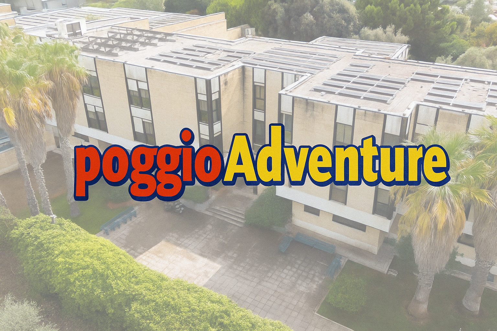
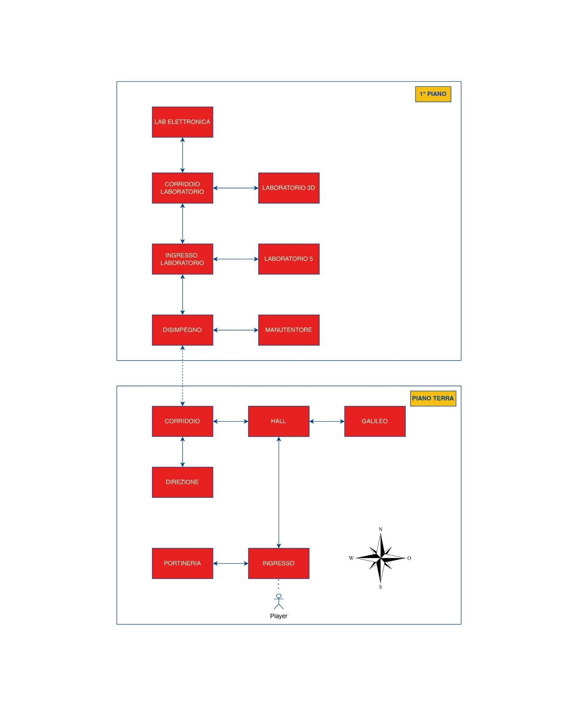

# PoggioAdventure 🎮

Un'avventura testuale ambientata nel Collegio di PoggioLevante a Bari, sviluppata come progetto per l'esame di Metodi Avanzati di Programmazione (A.A. 2024/2025).



## 📖 Descrizione

**PoggioAdventure** è un'avventura testuale che porta il giocatore attraverso le prove che una matricola deve affrontare per entrare a far parte del Collegio di PoggioLevante. Il gioco combina elementi di puzzle, logica e azione in un'esperienza narrativa coinvolgente.

### 🎯 Caratteristiche Principali

- **3 Livelli di Gioco**: Test di Logica, Sfida Tecnica e Crisi dei Robot
- **Doppia Modalità**: Interfaccia grafica (GUI) o linea di comando (CLI)
- **Sistema di Salvataggio**: Salva e carica le partite in qualsiasi momento
- **Classifica Online**: Compete con altri giocatori per il miglior punteggio
- **Personaggi Unici**: Interagisci con NPC ispirati a persone reali del collegio
- **Grafica Studio Ghibli**: Immagini dei personaggi e delle stanze in stile artistico (solo GUI)

> **Nota**: Ogni riferimento a fatti, eventi o persone reali è da intendersi in chiave puramente ironica e umoristica.

## 🚀 Installazione

### Prerequisiti

- Java JDK 19
- Maven
- Connessione internet (per la classifica online)

### Compilazione

1. Clona la repository:
```bash
git clone https://github.com/[tuo-username]/poggioAdventure.git
cd poggioAdventure
```

2. Compila il server:
```bash
mvn clean install -f poggioServer/pom.xml
```

3. Compila il gioco:
```bash
mvn clean install -f poggioAdventure/pom.xml
```

## 🎮 Come Giocare

### 1. Avvia il Server (necessario per la classifica)
```bash
cd poggioServer/target
java -jar poggioServer.jar
```

### 2. Avvia il Gioco

**Modalità GUI (consigliata):**
```bash
cd poggioAdventure/target
java -jar poggioAdventure.jar --gui
```

**Modalità CLI:**
```bash
java -jar poggioAdventure.jar --cli
```

## 🗺️ Mappa di Gioco



## 🎯 Obiettivo

Completa le tre prove per diventare un membro del collegio:

1. **Test di Logica**: Metti alla prova le tue capacità di ragionamento
2. **Sfida Tecnica**: Dimostra le tue competenze pratiche
3. **Crisi dei Robot**: Salva il collegio da un'emergenza inaspettata

Il punteggio finale dipende dal tempo impiegato e dal numero di comandi utilizzati.

## 🛠️ Architettura Tecnica

### Design Patterns Utilizzati

- **State Pattern**: Gestione dei livelli di gioco
- **Observer Pattern**: Sistema di eventi e azioni
- **Singleton Pattern**: Cronometro di gioco
- **Strategy Pattern**: Gestione input/output CLI/GUI
- **Template Method**: Struttura delle interfacce grafiche
- **Factory Pattern**: Creazione delle istanze di Engine

### Tecnologie

- **Frontend**: Java Swing con tema FlatLaf
- **Backend**: JAX-RS REST API con Jersey
- **Database**: H2 embedded con JDBC
- **Persistenza**: Serializzazione Java per i salvataggi
- **Networking**: Client HTTP per comunicazione con server

### Struttura del Progetto

```
poggioAdventure/
├── poggioAdventure/     # Client del gioco
│   ├── src/
│   │   ├── core/        # Motore di gioco
│   │   ├── model/       # Entità del gioco
│   │   ├── parser/      # Parser dei comandi
│   │   ├── levels/      # Logica dei livelli
│   │   ├── observers/   # Pattern Observer
│   │   └── ui/          # Interfacce CLI/GUI
│   └── resources/       # Risorse (immagini, font, etc.)
│
└── poggioServer/        # Server REST
    ├── src/
    │   ├── db/          # Gestione database
    │   ├── resources/   # Endpoint REST
    │   └── filters/     # Sicurezza API
    └── resources/       # File di configurazione
```

## 👥 Team di Sviluppo - BrokenMelons

- **Tommaso Orlando** - [Strix89](https://github.com/Strix89)
- **Michele Russo** - [MikeRvsso](https://github.com/MikeRvsso)
- **Elia Valenza** - [Elia-Valenza26](https://github.com/Elia-Valenza26)

## 📝 Licenza

Questo progetto è sviluppato per scopi didattici nell'ambito del corso di Metodi Avanzati di Programmazione presso l'Università degli Studi di Bari Aldo Moro.

## 🔗 Collegamenti Utili

- [Sito del Collegio PoggioLevante](https://www.poggiolevante.it/)
- [Documentazione Completa](Docs/DocMD.md)

---

*Sei pronto a intraprendere questo viaggio verso la beatificazione eterna? Il collegio e tutti i santi ti stanno aspettando!*